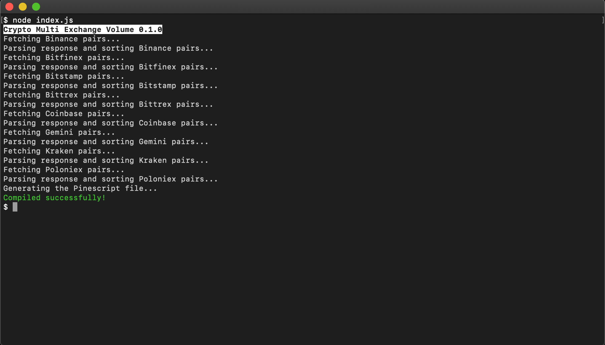

# Crypto Multi Exchange Volume Documentation



## Overview

CMEV is a Tradingview-compatible Pine Script v4 indicator which is generated by a Node.js CLI application. It is comprised by three main stages:

1. Getting all cryptoasset pairs from each exchange via Fetch GET API calls and sorting them.

2. Pruning the pairs via various means such as comparing their base assets, their uniqueness and their exclusion criteria (check index.js).

3. Generating the output Pine file.

## Setup & Use

To get up and running, clone the repository to your desired location and run the following commands to install the dependencies and to run the application:

```shell
npm install
npm start
```

The output indicator named crypto-multi-exchange.volume.pine by default will then be generated inside the root folder.

If you would like to manually build the application and execute it, run the following commands:

```shell
npm build
cd dist
node index.js
```

### Configuration

You can configure how the application prunes cryptoasset pairs by changing various settings found in index.js. These settings include a list of base assets and quote assets whereby a consisting pair can be excluded from pruning and settings for asset naming variations. Check the comments in index.js for more information.

If you would like to change the basic settings in the generated Pine file (e.g. color of the volume histogram), please refer to the skeleton files found in /src/skeleton.

## Pine Script Limitations

The key reason that makes the development of complex Pine Script indicators difficult is the number of limitations Tradingview imposes when compiling and running them. These namely include, but are not limited to:

* Imposing a maximum of 500 local scopes (i.e. how many nested if statements you can use)
* Imposing the scope of a non-terniary if statement
* Limiting the amount of time the indicator has to compile
* Limiting the amount of time the indicator has to load
* Limiting the amount of security() functions calls per script
* Limiting the amount of total function calls

Because of these limitations, the application should be configured at an individual level to accommodate the desired cryptoasset pairs, should be configured to include the minimum possible amount of cryptoasset pairs and should be thoroughly tested. Also note that through additions of new cryptoasset pairs on exchanges the default configuration for pair pruning is likely to become insufficient.

## More Information

If you would like to know more about how to create or modify a Pine Script indicator, please refer to the [Pine Script Reference Manual](https://www.tradingview.com/pine-script-reference/).
